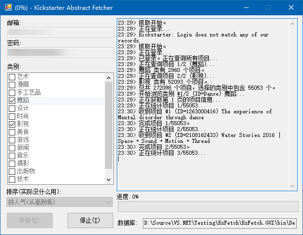

# KsFetch

抓取 Kickstarter 上的产品信息并导入数据库。

## 项目结构

- KsFetch: 与 Kickstarter 的网络通信和实体/契约定义。一部分是受到 [kickscraper](https://github.com/markolson/kickscraper) 的启发。
- KsFetch.GUI: 图形化操作界面，含数据库操作。

## 构建

clone 下来之后，使用 NuGet Package Manager 安装缺失的包（在 Visual Studio 中这一步很简单），然后编译运行。

## 用户使用手册

### 使用方法：

1. 请确保计算机中安装好了 .NET Framework 4.5。如果不确定请到[微软网站](https://www.microsoft.com/zh-cn/download/details.aspx?id=30653)上下载安装。
2. 运行，填写 Kickstarter 的邮箱和密码（通过 API 获取项目数据需要登录）后单击“开始”，选择数据库文件的保存位置，等待完成。
3. 下载一个 [SQLiteStudio](http://sqlitestudio.pl/?act=download)，添加刚刚导出的数据库后连接（双击），展开数据表，选择 ks_main 表右键导出为 CSV。（分隔符选择逗号，因为 Excel 只认逗号；编码选择 GBK，因为 Excel 只认 ANSI 编码，在中文环境下是 GBK。）
4. 用 Excel 打开导出的 CSV，大功告成。注意，货币有不同，不过三位货币码和（对美元）汇率都列出来了。

### 其他说明：

1. KS上的项目 API 没有reward的人数限制数据，所以没有一个判断项目的某种reward是不是满人。（虽然网站上可以看到是否还能参与某个reward……总之不想抓网页，那个数据量太大。）
2. 所有的操作（操作信息、错误信息）会保存到 logs 文件夹下，基本上发生了什么可以从看到。
3. 如果开始运行就不好了，请看日志，有可能能记录下来；刚看了 sqlite3.dll 的导入表，对 VCRT 没有特殊需求，所以不是那些什么“缺少C++运行库”之类的错误。
4. 连接稳定性可能不好，而且KS会主动ban（请求太频繁之后就开始放 HTTP 4xx 错误，虽然标题是 HTTP 500），最后可能会到连接超时（就是连不上）导致无法继续，所以不能保证列出了N个就获得N个的数据，实际数据以数据库里记录的为准。如果有毅力、有恒心，可以试试多次轰炸……不过一旦KS开始ban你，在十几分钟内通过 API 除了登录和获取项目数量之外都做不了什么，网站访问倒是正常。

## 许可

[WTFPL](http://www.wtfpl.net/txt/copying/)（嗯其实就差不多是 public domain 啦）
